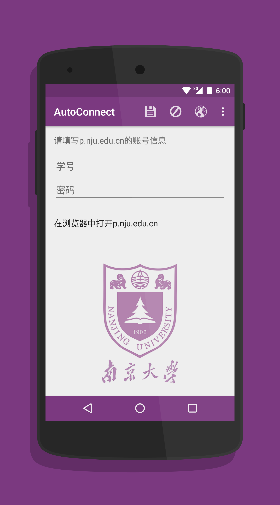
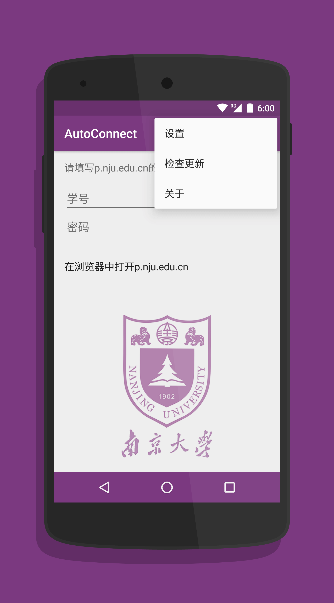
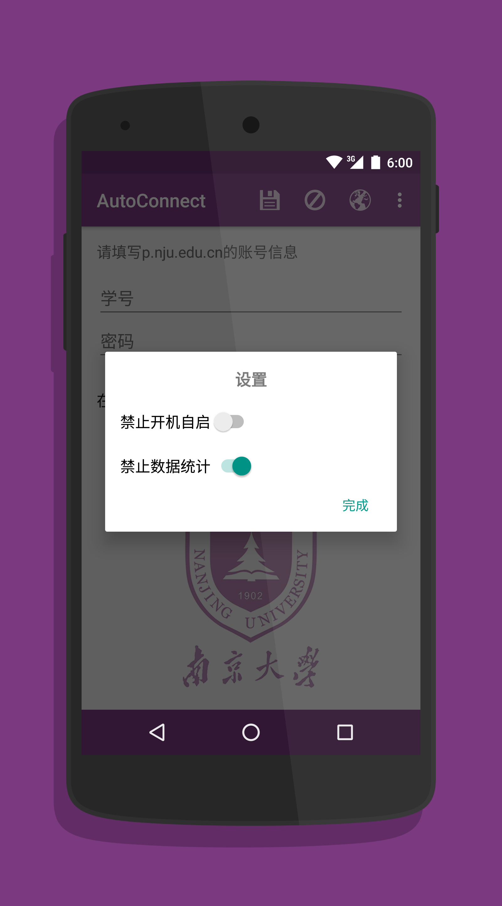
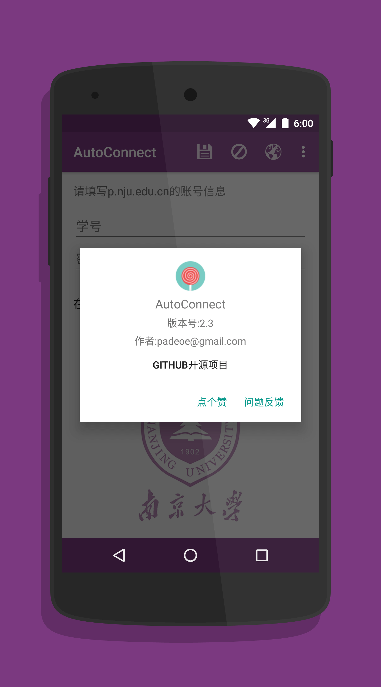

NJUNet Android App
======================

NJUNet是一个用于安卓手机连接到NJU-WLAN后自动登陆p.nju.edu.cn的Android程序，代替手动打开浏览器登陆的繁琐操作，做到有NJU-WLAN的地方总是保持网络连接。

<h2>适用平台</h2>
Android 4.0+

## See Also

+ [Windows](https://github.com/miaoxw/Auto-p.nju)
+ [Mac](https://github.com/Cee/PNJU-TodayWidget)
+ [iOS &  Watch](https://github.com/Cee/PNJU-Watch)
+ [Alfred Workflow](https://github.com/Cee/PNJU-Workflow)

<h2>截图</h2>

<h2>功能说明</h2>
- 可手动进行登陆，下线，查看登陆数据(时长，余额等)
- 默认开启后台服务，将在连接上南大校园网WLAN时自动登陆
- 可以使用状态栏通知快捷登陆

<h2>更新日志</h2>

- [查看更新日志](https://github.com/padeoe/AutoConnect/blob/newUI/UPDATE.md)

<h2>如何使用源代码构建并运行</h2>
- [查看build instruction](https://github.com/padeoe/AutoConnect/blob/newUI/BUILDING.md)

<h2>特别感谢</h2>
- 技术顾问[@Nifury](https://github.com/Nifury)